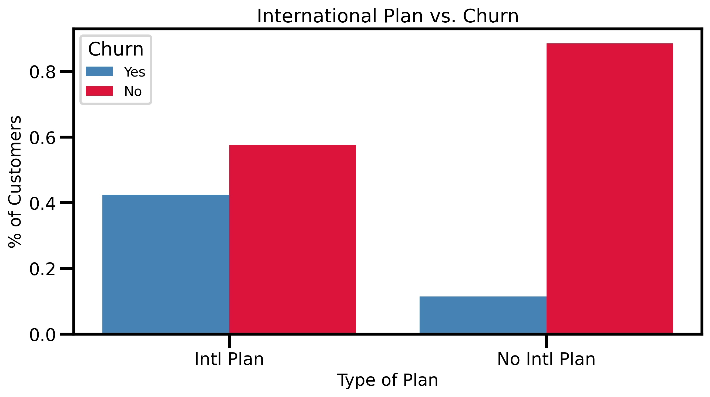
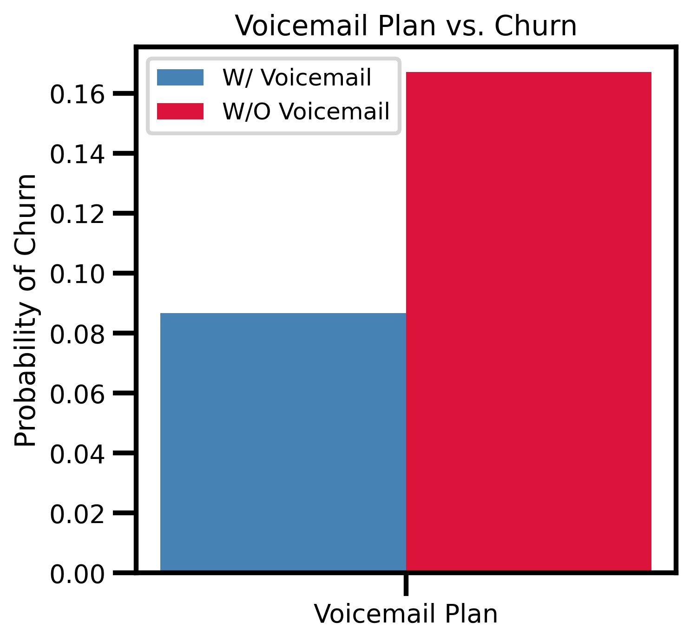
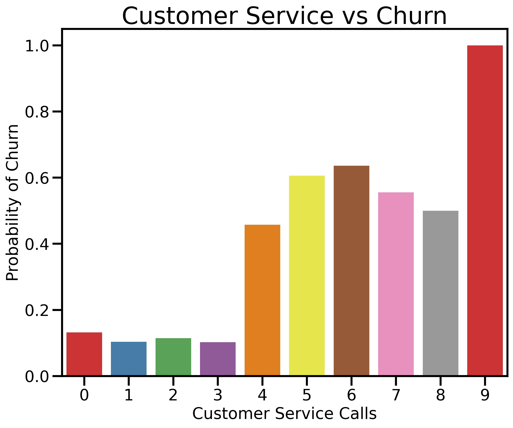
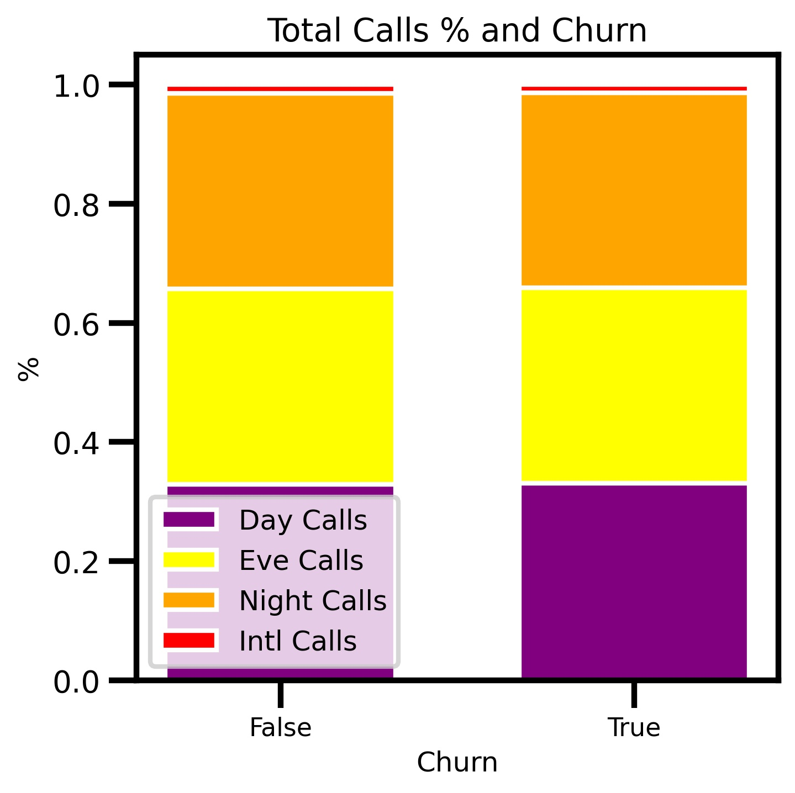

# SyriaTelProject
Flatiron Phase 3 Project - Customer Churn @ SyriaTel 


**Authors**
[Aalok Joshi](https://www.linkedin.com/in/aalokjoshi113/), [Sumedh Bhardwaj](https://www.linkedin.com/in/sumedh-bhardwaj-932767202/), [Wahaj Dar](https://www.linkedin.com/in/wahaj-dar-/)

# Introduction

SyriaTel is a telecommunications company hoping to foresee and prevent client churn. Customer churn is the percentage of clients that quit utilizing an company's product or service during a specific time span. It very well may be a significant issue since it impacts a company's client faithfulness and ultimately influences company's revenue.
We built a classfier to predict when a customer will soon stop doing business with SyriaTel. The audience will be SyriaTel itself who are interested in how to improve their customer rettention rates.

# Dataset
For this project the data we used can be found [here](https://www.kaggle.com/becksddf/churn-in-telecoms-dataset). It contained 21 columns and and 3333 rows. It was already pretty much clean with no null values or any outliers.

# What modeling algorithm works best?

We used Logistic Regression, K-Neighbors, and Decision trees to model our prediction for churn data.

# Models

### Account Length

We saw that account length doesn't seem to have a significant effect on the overall chance a customer quits SyriaTel's service or not because the means and standard deviations are relatively the same. (Std Dev difference was ~0.02 while Mean difference was ~0.06)
- Mean Account Length for Churn: 3.42
- Standard Deviation Account Length for Churn: 1.32
- Mean Account Length for Not Churn: 3.36
- Standard Deviation Account Length for Not Churn: 1.33


### International Plan
323 customers out of the 3333 total customers subscribed to an International Plan while the other 3010 customers didn't have an International Plan. Out of those with an international plan around 42% left SyriaTel while those without that specific plan only churned at a rate of around 11.5%. Thus, the percentage of customers who churn is much higher for those with international plans than those without one.



### State
California, Maryland, New Jersey, and Texas have the highest churn rates. Alaska & Hawaii had the lowest churn rate. But there isn't a clear reason why certain states perform better than others unless we had additional data on discounts by region, signal stregth, etc.


### Voicemail Plan
The percentage of customers who churned is higher for customers with no voicemail plans (~17%) than those with a voicemail plan (~9%). 



Those customers who received more voicemail messages often trended to a higher churn tendency.


### Customer Service Calls
Our current churn rate is about 14.5%. When we took a look at customer service calls, we saw that as the number of customer service calls increases, the probability of churning increased as well. At the certain point of at least 4 customer service calls, the probability of a customer churning increases from about 10% to 50%. Most of the customers who made 0-3 calls tended not to leave the service.



### Rates 
- Day Rates = $0.17/min
- Evening Rates = $0.08/min
- Night Rates = $0.45/min
- Intl Rates = $0.27/min
- No Intl Rates = $0.27/min

These are the rates for certain time periods and plans that calls take place in. As we found out the rates for International Plans and Non-International plans were same at $0.27 per minute.

### Total Calls
The timing of the day and the type of plan had no effect on a customer churning or not, since all usage rates were relatively the same.



# Interpretation


# Recommendation
- We recommend that we should implement customer feedback surveys for customer churn. We could provide an incentive for customers to fill out a survery if they end up leaving us. We could have questions like what they like about our service or what we could have done to better our services. By provding them a incentive to fill out a survery it would increase the probabilty of customers filling it out. 
- Our second recommendation would be to revise the company's customer service protocol. Based off the "Customer Service Calls" model after a customer makes more than 3 calls to customer service there was a signifcant jump in the probabilty of churning. To treat this we could have a system that keeps track of how many calls have been recieved from a certain customer and flag that account so we know that we should be more sensitive to this customer.    
- Our final recommendation is to start a reach-out campaign for customers who have a international plan. Working with the marketing department we could start targeting customers with possible deals or promotions that we are offering in order to get new customers or ex customers back with better rates than our competitors. 

# Future Analysis
- We want to acquire more data on cell signals across the US for patterns in states with higher churn. Bad cell signals could indicate a higher probability that customers in a certain state will churn in that state. 
- In the future we would want to be able to use data on specific issues customers called in to customer service with so if we see that it is a repetitive issue we can quickly resolve it. If there is a trend in a specific issue then it is likely that more customers will have that issue as well.  

# For More Information
Please review our full analysis in our [Jupyter Notebook](Final_Notebook.ipynb) or [presentation deck](./Project3_Presentation.pdf).

## Repository Structure
```
├── README.md                           <- The top-level README for reviewers of this project
├── Final Notebook .ipynb               <- Narrative documentation of analysis in Jupyter notebook
├── Project3_presentation.pdf           <- PDF version of project presentation
├── customer_churn_data.csv             <- Both sourced externally and generated from code
└── Images                              <- Both sourced externally and generated from code
